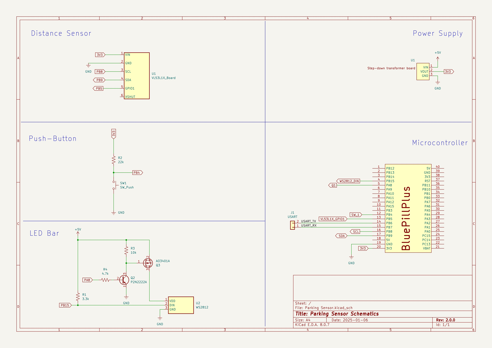

  

# Parking Sensor

## Description
Programmable parking sensor that detects the distance from an approaching vehicle and displays it on a LED bar

## Hardware needed
- 1 STM32F103C8T6 (Blue Pill)
- 1 ST VL53L1X LIDAR/Time-of-Flight sensor
- 1 WS2812B LED bar
- 1 Push-button
- 1 IRLZ34N MOSFET
- 1 5V-3V3 step-down voltage regulator (optional, to power the microcontroller and the sensor without using the on-board regulator)
> [!IMPORTANT]  
> To power a 40-LEDs bar, a power supply of at least 5V-2A is needed

## Schematics

## Configuration
Low-level configuration is performed via the following parameters, defined in `parkingConfig.h`:
| Parameter                            | Default Value | Description                                             |
| ------------------------------------ | ------------- | ------------------------------------------------------- |
| **Timer Configuration**              |               |                                                         |
| `configTIMER_BUTTON_MS`              | 100           | Button reading timer interval (ms)                      |
| `configTIMER_LED_MS`                 | 1000          | LED control timer interval (ms)                         |
| `configTIMER_BRIGHTNESS_MS`          | 50            | LED brightness control timer interval (ms)              |
| `configTIMER_MEASURE_MS`             | 210           | LIDAR reading timer interval (ms)                       |
| **Measure Configuration**            |               |                                                         |
| `configMIN_DISTANCE_MM`              | 50            | Distance from target where LEDs start blinking red (mm) |
| `configMEASURING_RANGE_MM`           | 1200          | Distance from target where LEDs light up green (mm)     |
| `configMEASURING_STOP_MM`            | 1300          | Distance where LEDs turn off (RANGE + 100mm)            |
| `configMIN_APPROACH_SPEED_MM_S`      | -15           | Minimum approach speed to detect movement (mm/s)        |
| `configMEASURING_START_DELAY_MS`     | 300           | Delay to start measuring when still (ms)                |
| `configMEASURING_STOP_DELAY_MS`      | 7000          | Delay to stop measuring when still (ms)                 |
| **LED Strip Configuration**          |               |                                                         |
| `configLED_NUMBER`                   | 40            | Number of LEDs in the strip                             |
| `configLED_PER_IRQ`                  | 8             | Number of LEDs processed per interrupt                  |
| `configLED_BRIGHTNESS_WAIT_MS`       | 3000          | Wait time at max/min brightness before reversing (ms)   |
| `configLED_BRIGHTNESS_SAVE_DELAY_MS` | 5000          | Delay to save brightness setting (ms)                   |
| **LIDAR Configuration**              |               |                                                         |
| `configLIDAR_TIMING_BUDGET_MS`       | 200           | LIDAR timing budget (ms) [15,20,33,50,100,200,500]      |
| `configLIDAR_IM_TIME_MS`             | 205           | Inter-measurement time (ms)                             |
| **Button Configuration**             |               |                                                         |
| `configBUTTON_DEBOUNCING_MS`         | 50            | Button debouncing time (ms)                             |
| `configBUTTON_RESET_MS`              | 400           | Button press reset time (ms)                            |
| `configBUTTON_LONGPRESS_MS`          | 1000          | Button long-press time (ms)                             |
| `configBUTTON_VERYLONGPRESS_MS`      | 2000          | Button very-long-press time (ms)                        |
| **MovingAverage Configuration**      |               |                                                         |
| `configMOVAVG_LIDAR_SAMPLES`         | 2             | Number of samples for LIDAR moving average              |
| `configMOVAVG_APPSPEED_SAMPLES`      | 2             | Number of samples for approach speed moving average     |

> [!NOTE]
> Microcontroller clock frequency is reduced to 16 MHz to minimize idle consumption.
> If some LEDs are displaying wrong colors, increase clock to 24 MHz or more and adjust TIM1 period accordingly

## Operation
### Set target distance
1. Bring an object at the target distance from the sensor
2. Double-click on the push-button to acquire and set the target distance
### Set brightness
1. Keep the push-button pressed for more than `configBUTTON_VERYLONGPRESS_MS` milliseconds to change brightness
2. Current brightness level is shown via the LED bar both as % and as real brightness
3. To reverse direction (increase / decrease), briefly release and press again the push-button
4. Once the desired brightness has been reached, release the push-button to save it
### Distance measurement
Operation is fully automatic. LEDs will turn on as soon as an object approaches the sensors at the configured speed and will turn off once the object is stopped or too far away